# 分析设计市场法房地产估价模型
## 完全借鉴：https://www.kaggle.com/marsggbo/kaggle/notebook
## 总结：失败，变量相关性极低的情况下强行拟合结果，无意义，有待继续尝试
```python
# 导入所需要的模块
# 导入需要的模块
import pandas as pd
import matplotlib.pyplot as plt
import numpy as np
# 用来绘图的，封装了matplot
# 要注意的是一旦导入了seaborn，
# matplotlib的默认作图风格就会被覆盖成seaborn的格式
import seaborn as sns
from scipy import stats
from scipy.stats import norm
from sklearn.preprocessing import StandardScaler
import warnings
warnings.filterwarnings('ignore')
%matplotlib inline
# 为了在jupyter notebook里作图，需要用到这个命令
```

## 样本数据：
上海市浦东新区陆家嘴东路161号 80㎡ 取10000m内3年内成交项目分别作sifa、ershou
```python
data_sifa = pd.read_excel("./sifa.xlsx")
data_ershou = pd.read_excel("./ershou.xlsx")
```

## 分析单价：
### sifa:
```python
print(data_sifa['single_price'].describe())
sns.distplot(data_sifa['single_price'])
plt.show()
print("Kurtosis: %f" % data_sifa['single_price'].kurt())
print("Skewness: %f" % data_sifa['single_price'].skew())
```
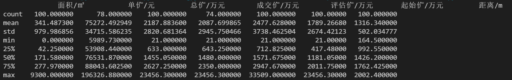
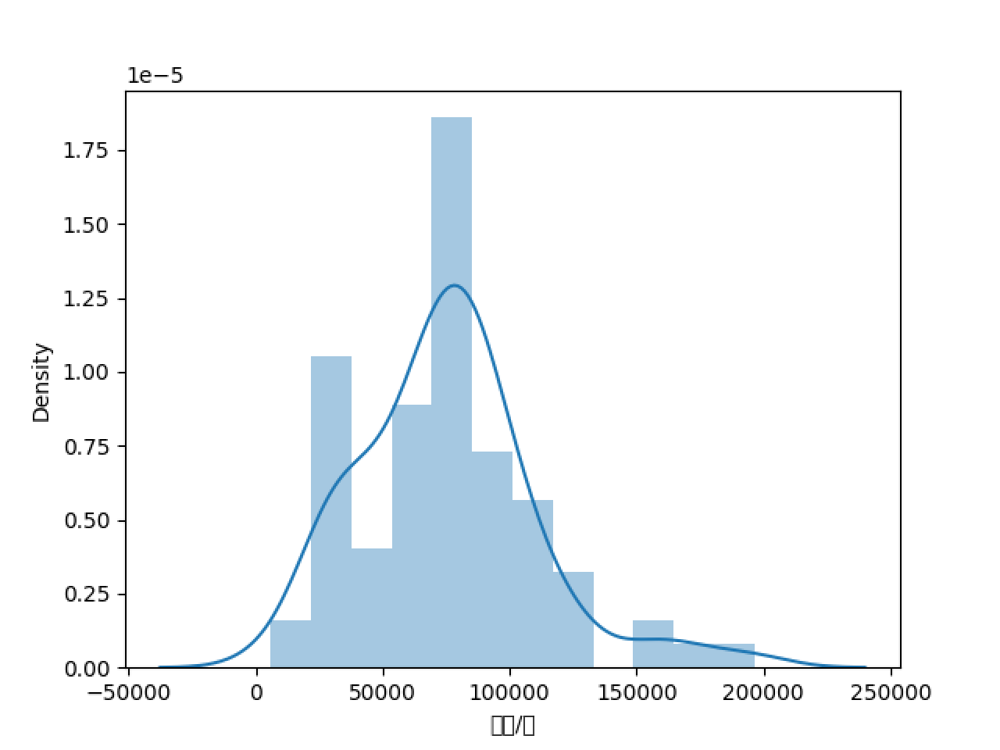
* 峰度：1.779291
* 坡度：0.856381

### ershou:
```python
print(data_ershou['single_price'].describe())
sns.distplot(data_ershou['single_price'])
plt.show()
print("Kurtosis: %f" % data_ershou['single_price'].kurt())
print("Skewness: %f" % data_ershou['single_price'].skew())
```
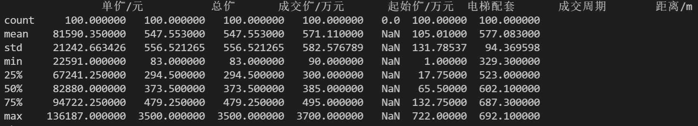
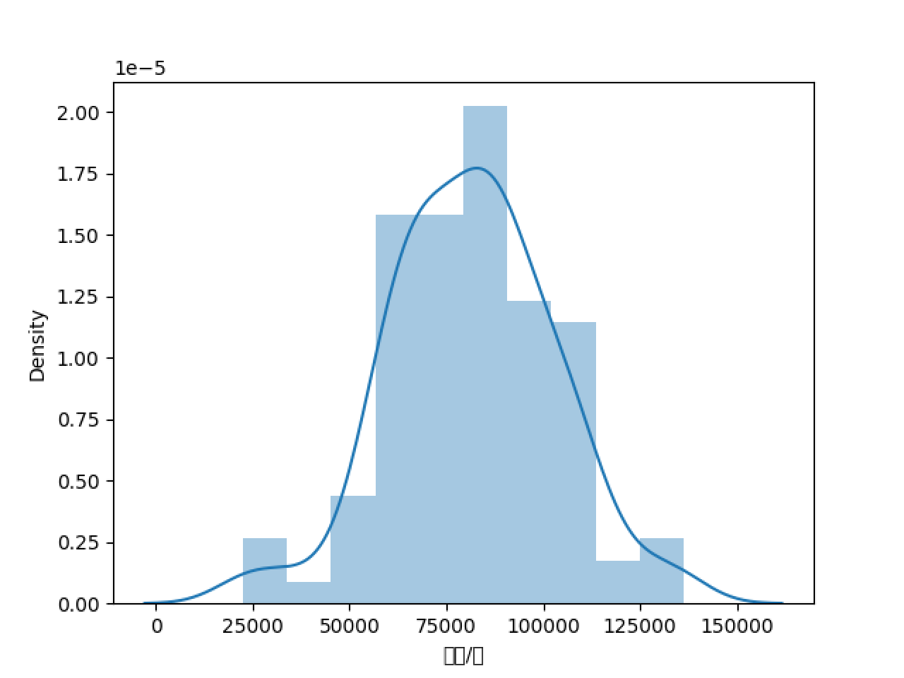
* 峰度：0.46634
* 坡度：-0.060402

## 分析特征数据：

* Variable：变量名
* Data Type：各变量的数据类型，分为“数值型--0”和“类别型--1”
* Segment变量的类型。分为：“building--0”、“space--1”、“location--2”、“date--3”、“source--4”。具体解释如下：
  * building：比如房屋材料、造型等与房屋物理特性相关的特征（e.g. 'OverallQual'）
  * space：即与房屋空间有关的特征，如面积(e.g. 'TotalBsmtSF')
  * location：距离(e.g. 'Neighborhood')
  * date：历史项目成交到当前时间的日期间隔(e.g. 'days')
  * source：历史拍卖项目的来源(e.g. 'source')
* Expectation：表示我们认为该变量对于“SalePrice”的影响程度，划分为“High---3”，“Medium---2”，“Low---1”
* Conclusion：与“Expectation”类似，这个表示我们在观察完数据后得出的结论，其实也可和“Expectation”相同。
* Comments：注释

## 验证主要特征是否满足要求：
**此处将sifa.xlsx和ershou.xlsx合并为data.xlsx并统一变量名及变量值**
### 类别型：
#### source--来源：
* 司法拍卖：0
* 二手房：1

```python
var = 'source'
data = pd.concat([data_src['single_price'], data_src[var]], axis=1)
fig = sns.boxplot(x=var, y="single_price", data=data)
fig.axis(ymin=0, ymax=250000)
plt.show()
```
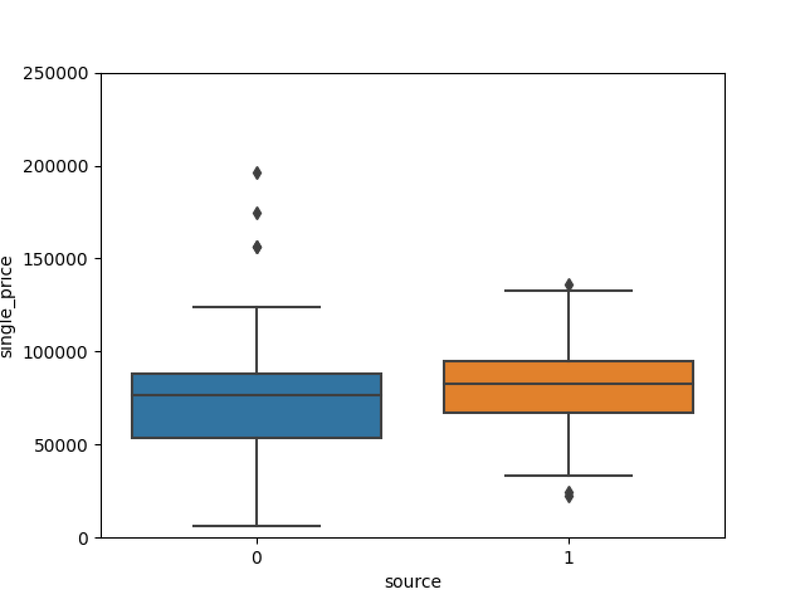  
可以看出二手房的价格明显偏高

#### usage--资产种类：
* 商业：0
* 工业：1
* 住宅：2
* 办公：3
* 其他：4

```python
var = 'usage'
data = pd.concat([data_src['single_price'], data_src[var]], axis=1)
fig = sns.boxplot(x=var, y="single_price", data=data)
fig.axis(ymin=0, ymax=250000)
plt.show()
```
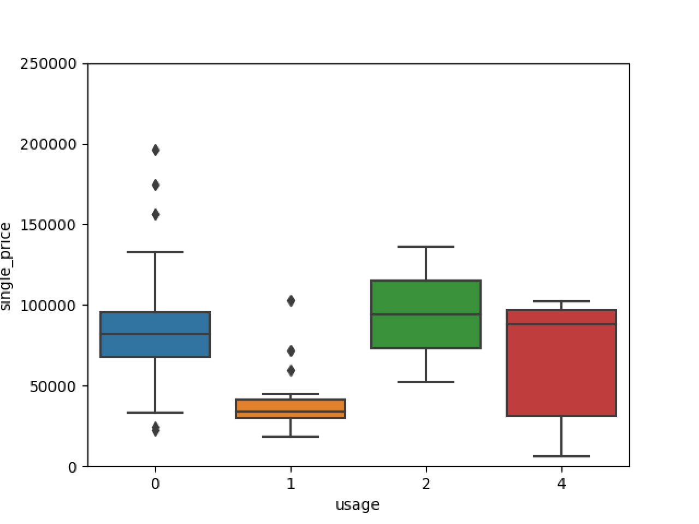
可以看出五种价格均有所不同

#### decoration--装修：
* 简装：0
* 精装：1
* 毛胚：2
* 其他：3

```python
var = 'decoration'
data = pd.concat([data_src['single_price'], data_src[var]], axis=1)
fig = sns.boxplot(x=var, y="single_price", data=data)
fig.axis(ymin=0, ymax=250000)
plt.show()
```
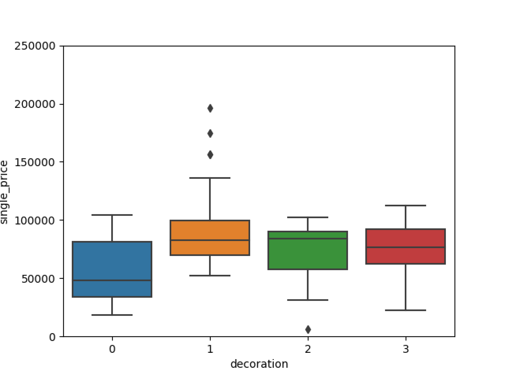
可以看出简装比较突出，其他3种差别不大

### 数值型：
#### area--面积：
```python
var = 'area'
data = pd.concat([data_src['single_price'], data_src[var]], axis=1)
data.plot.scatter(x=var, y='single_price', ylim=(0, 250000))
```
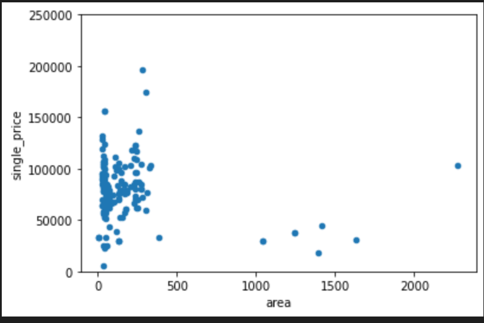
可以看出面积与单价并没有明显关系

#### distance--距离：
```python
var = 'area'
data = pd.concat([data_src['single_price'], data_src[var]], axis=1)
data.plot.scatter(x=var, y='single_price', ylim=(0, 250000))
```
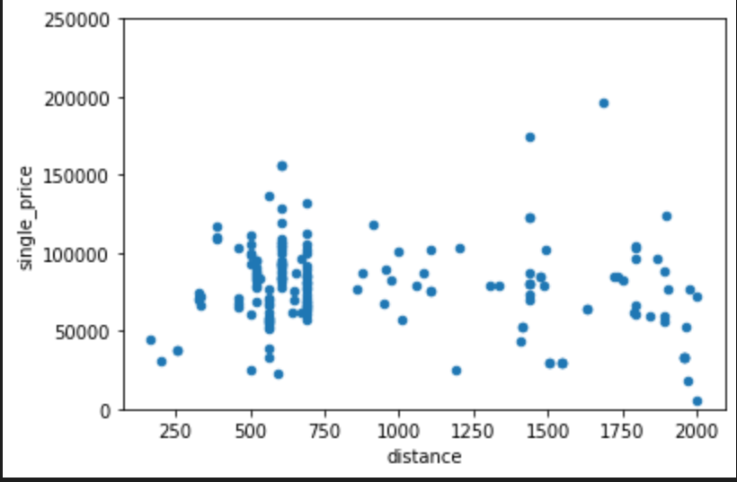
可以看出距离与单价有一定相关性，但具体关系暂不明确，更换数据集后发现结果仍相似

#### days--天数：
```python
var = 'days'
data = pd.concat([data_src['single_price'], data_src[var]], axis=1)
data.plot.scatter(x=var, y='single_price', ylim=(0, 250000))
```
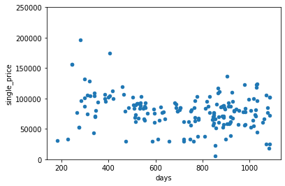
看起来是有一定的相关性。。


## 更加科学地分析数据
为了做到更加科学，我们需要作如下工作：
* 得到各个特征之间的关系矩阵（correlation matrix）
* 'SalePrice'的关系矩阵
* 绘制出最相关的特征之间的关系图

### 关系矩阵heatmap
```python
corrmat = data_src.corr()
f, ax = plt.subplots(figsize=(20, 9))
sns.heatmap(corrmat, vmax=0.8, square=True)
```
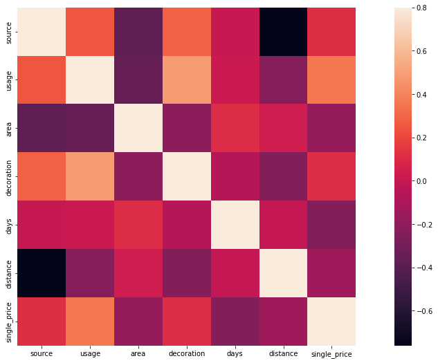
像素块越红表示两者之间相关性越强，我们可以很清楚地看到与“SalePrice”相关性很强的有：  
处理离散型数据后的heatmap：
```python
from sklearn import preprocessing
f_names = ['source', 'usage', 'decoration']
for x in f_names:
    label = preprocessing.LabelEncoder()
    data_src[x] = label.fit_transform(data_src[x])
corrmat = data_src.corr()
f, ax = plt.subplots(figsize=(20, 9))
sns.heatmap(corrmat, vmax=0.8, square=True)
```
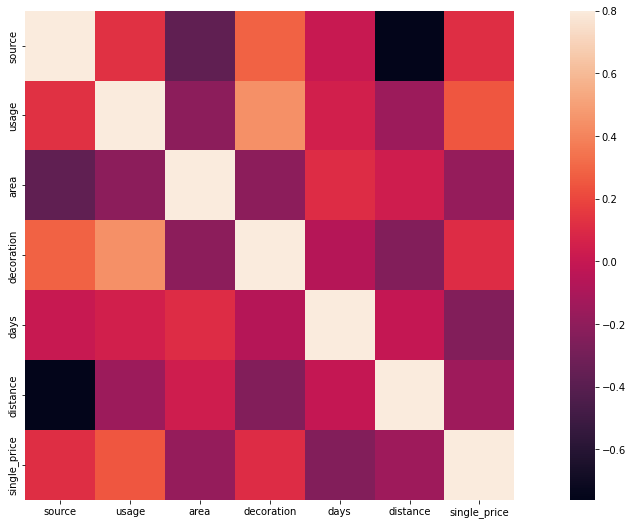

### 房价关系矩阵
```python
import numpy as np
k  = 10 # 关系矩阵中将显示10个特征
cols = corrmat.nlargest(k, 'single_price')['single_price'].index
cm = np.corrcoef(data_src[cols].values.T)
sns.set(font_scale=1.25)
hm = sns.heatmap(cm, cbar=True, annot=True, \
                 square=True, fmt='.2f', annot_kws={'size': 10}, yticklabels=cols.values, xticklabels=cols.values)
plt.show()
```
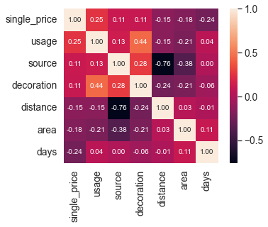

### 绘制关系点图
```python
sns.set()
cols = ['single_price','usage','source', 'decoration','distance', 'area', 'days']
sns.pairplot(data_src[cols], size = 2.5)
plt.show()
```
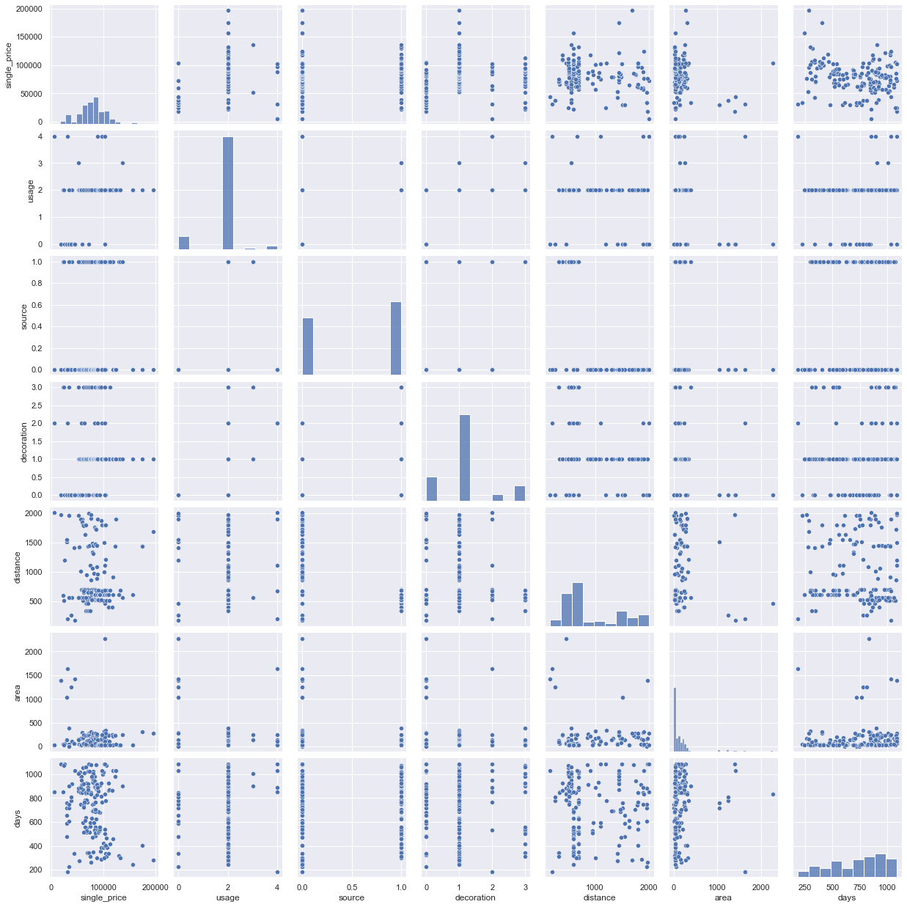

## 开始模拟数据
```python
from sklearn import preprocessing
from sklearn import linear_model, svm, gaussian_process
from sklearn.ensemble import RandomForestRegressor
from sklearn.cross_validation import train_test_split
import numpy as np
```
```python
cols = ['usage','source', 'decoration','distance', 'area', 'days']
x = data_train[cols].values
y = data_train['single_price'].values
x_scaled = preprocessing.StandardScaler().fit_transform(x)
y_scaled = preprocessing.StandardScaler().fit_transform(y.reshape(-1,1))
X_train,X_test, y_train, y_test = train_test_split(x_scaled, y_scaled, test_size=0.33, random_state=42)
```
```python
clfs = {
        'svm':svm.SVR(), 
        'RandomForestRegressor':RandomForestRegressor(n_estimators=400),
        'BayesianRidge':linear_model.BayesianRidge()
       }
for clf in clfs:
    try:
        clfs[clf].fit(X_train, y_train)
        y_pred = clfs[clf].predict(X_test)
        print(clf + " cost:" + str(np.sum(y_pred-y_test)/len(y_pred)) )
    except Exception as e:
        print(clf + " Error:")
        print(str(e))
```
```python
cols = ['usage','source', 'decoration','distance', 'area', 'days']
x = data_train[cols].values
y = data_train['single_price'].values
X_train,X_test, y_train, y_test = train_test_split(x, y, test_size=0.33, random_state=42)

clf = RandomForestRegressor(n_estimators=400)
clf.fit(X_train, y_train)
y_pred = clf.predict(X_test)
print(y_pred)
```
# 保存clf，共下面计算测试集数据使用
# rfr = clf
```
## 检验测试集数据
```python
import pandas as pd
from sklearn.ensemble import RandomForestRegressor

# 之前训练的模型
rfr = clf
```
```python
data_test = pd.read_csv("./predict.xlsx")
cols2 = ['usage','source', 'decoration','distance', 'area', 'days']
data_test_x = pd.concat( [data_test[cols2]] ,axis=1)
data_test_x.isnull().sum()
x = data_test_x.values
y_te_pred = rfr.predict(x)
```
```python
prediction = pd.DataFrame(y_te_pred, columns=['single_price'])
result = pd.concat([ data_test['title'], prediction], axis=1)
# result = result.drop(resultlt.columns[0], 1)
result.columns

result.to_excel('./Predictions.xlsx', index=False)
```


